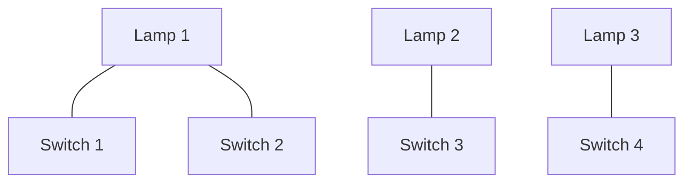
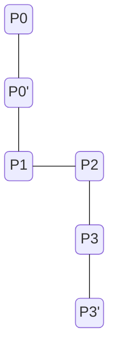

# Switch
Binary Lamp Switch Game - Crewate Binary Numbers (from 0 to 127) using Lamps :3
With each Iteration your time becomes less :3 Every 10 seconds the time gets less unless you just have 10s uwu

## Showcase

### Controls Desktop Version
ESC - naviagte Back to menu

Arrow Keys Up/Down: Navigate Main Menu

Enter/Sapcebar: Confirm selection in main menu

ArrowK Keys Left/Right & Sapcebar/Enter: navigate in Tutorial

0...7 Number Keys: Toggle Swicthes in Single Player

## Game Loop
* The game generates a random decimal number like 42
  * You have to translate this number into binary using the lamps
  * lamp on = 1 * 2^x, lamp of = 0 * 2^x (x beeing the exponent beeing equal to the lamps number)
		* Note: the lamp counts from the side where the arrow is pointing to the lamp row, the arrow defines the endianess of the lamp row
* when you have corectly replicated the number the remaining time will be added to your score
  * on every 10 iterations your time will get less, but you will always have atleast 10 seconds for a number  
  * there is a actually a point where the game will end ;3
 
### Multiplayer
Play together to solve numbers

	
## Supported Plattforms
| Plattform         | Status | Supported | Tested |
|--------------|:-----:| :----: | :----: |
| iOS | Testflight | :heavy_check_mark: | :heavy_check_mark:
| MacOS      |  Testflight | :heavy_check_mark:| :x:
| Android |  WIP  | :heavy_check_mark: | :heavy_check_mark:
| Windows      |  WIP | :heavy_check_mark:| :heavy_check_mark:

### Compiling for iOS
> **_NOTE:_**  Pls edit the build version in the project file to not be the same as the version number

### Compiling for Android (apk)
> **_NOTE:_** Keystore requiered
> 
## Development
### Map Generation
#### Pairing Lamps and Switches
Each lamp becomes a random switch assigned, one random lamps becomes a second random switch

#### Drawing Wires
* p0': Position of the lamp lx
* p0: Position of the lamp + padding pad1 (since we dont want the line to start in the middle of the lamp but rather bvelow the lamp)
* p1: p0 extended on the y-axis to the assigned level fx

* p3': Center Position of the Switch sx
* p3: Postion of sx with padding pad2
* p2: p3 extended on the y-axis to the assigned level fx

## Game Options
* Endian Switching (Changes the direction form where you have to read the number in binary)
* Sound Settings

## Requierements
* Gdoot 4.2.2

## Asset Sources
[Ping Sound - Pixabay](https://pixabay.com/sound-effects/ping-82822/)

[Background Sound - Pixabay](https://pixabay.com/sound-effects/daylight-14872/)

[Lex Font](http://www.pentacom.jp/pentacom/bitfontmaker2/gallery/?id=646)
